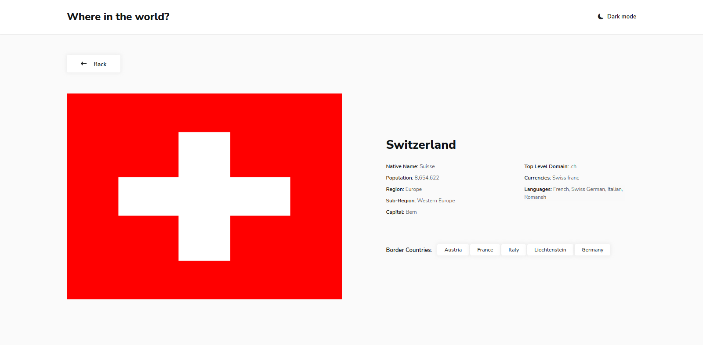

# Frontend Mentor - REST Countries API with color theme switcher solution with HTML, CSS, Bootstrap and JavaScript

This is a solution to the [REST Countries API with color theme switcher challenge on Frontend Mentor](https://www.frontendmentor.io/challenges/rest-countries-api-with-color-theme-switcher-5cacc469fec04111f7b848ca). 

## Table of contents

- [Overview](#overview)
  - [The challenge](#the-challenge)
  - [Screenshots](#screenshot)
  - [Links](#links)
- [My process](#my-process)
  - [Built with](#built-with)
  - [What I learned](#what-i-learned)
- [Author](#author)
- [Acknowledgments](#acknowledgments)

## Overview

### The challenge

Users should be able to:

- See all countries from the API on the homepage
- Search for a country using an `input` field
- Filter countries by region
- Click on a country to see more detailed information on a separate page
- Click through to the border countries on the detail page
- Toggle the color scheme between light and dark mode *(optional)*

### Screenshots

### Links

- Solution URL: (https://www.github.com/codegiyu/countries)
- Live Site URL: (https://codegiyu.github.io/countries)

## My process

I used mostly css grid for the layout of the pages with flexbox as support. After getting the country cards for each page, I copied the html code to the javascript to use it to populate the page based on the number of results. I then used a gif in an absolutely positioned div as a loading screen to keep my viewers a bit occupied as they wait for the data to be fetched from the API. 

For both the search results page and the single country page, I passed in key and value pair of information through their addresses and used that either in the fetch address or to filter the array of all countries. 

I also saved a variable to local storage that keeps tabs on the preferred mode (light mode or dark mode) of the user so they don't have to keep switching every time they open a new page.

### Built with

- Semantic HTML5 markup
- CSS custom properties
- Flexbox
- CSS Grid
- Desktop-first workflow
- Bootstrap
- JavaScript

### What I learned

- This was my first time putting in a gif loading screen to accomodate for the awkward waiting phase for API fetching. It was fun.
- I also broke away from my tendency to use Flexbox for everything and paid more attention to Grid this time around.
- Also my first time implementing a search function in a website.

## Author

- Website - [Github - Codegiyu](https://www.github.com/codegiyu)
- Frontend Mentor - [@codegiyu](https://www.frontendmentor.io/profile/codegiyu)
- Twitter - [@TheLonerider20](https://www.twitter.com/TheLonerider20)

## Acknowledgments

Thanks to [Natacha Danbadan](https://www.github.com/Natacha-Danbadan) for her timely help at some points during the project.
